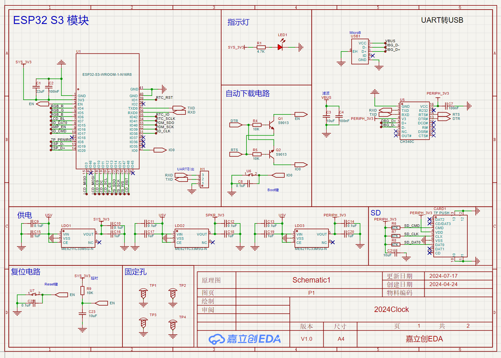
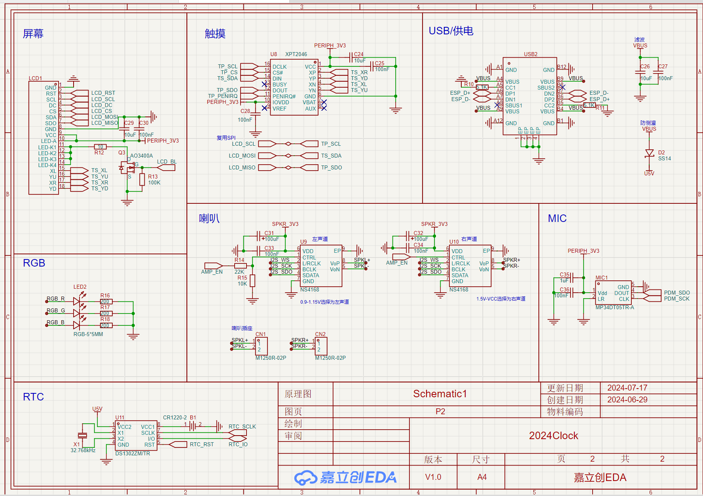
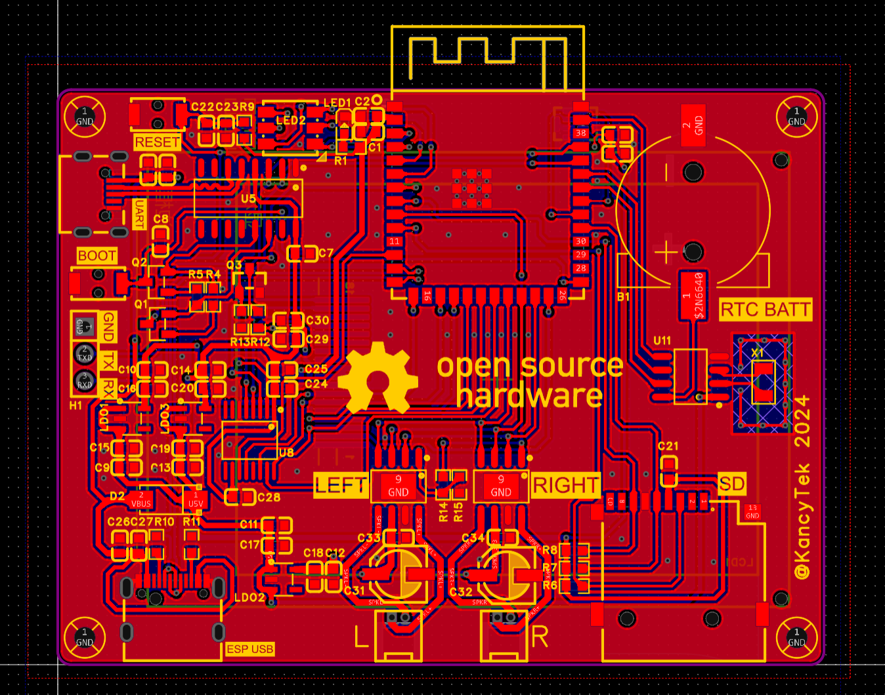
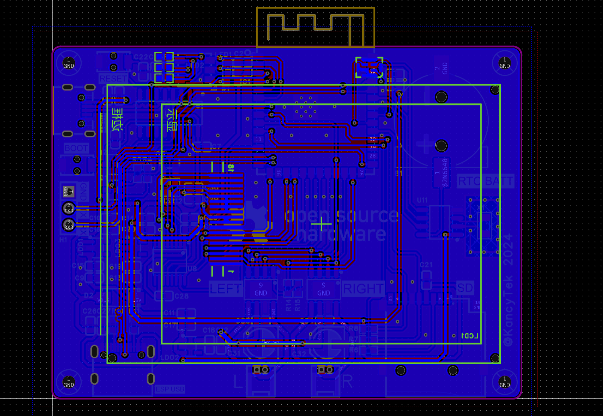
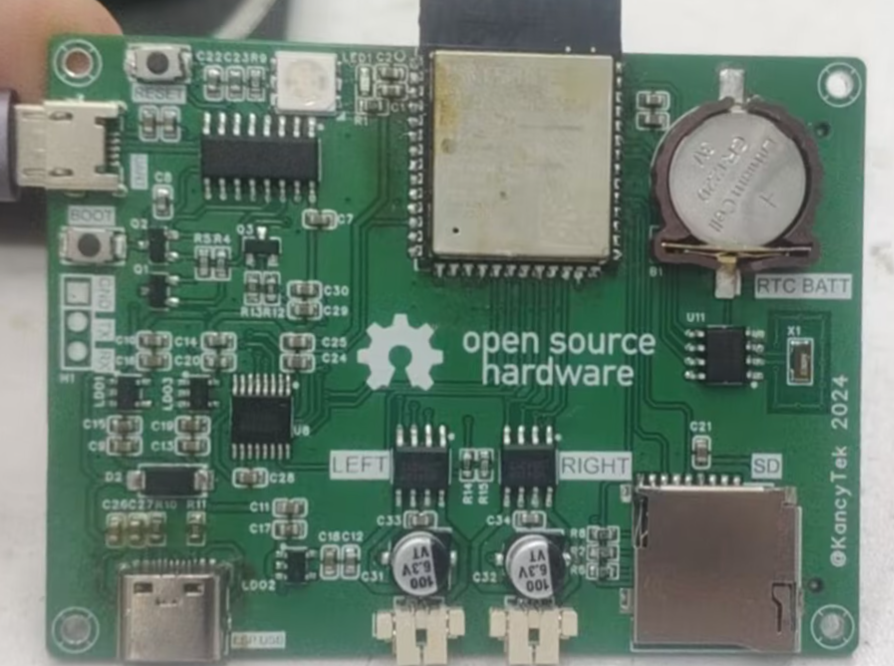
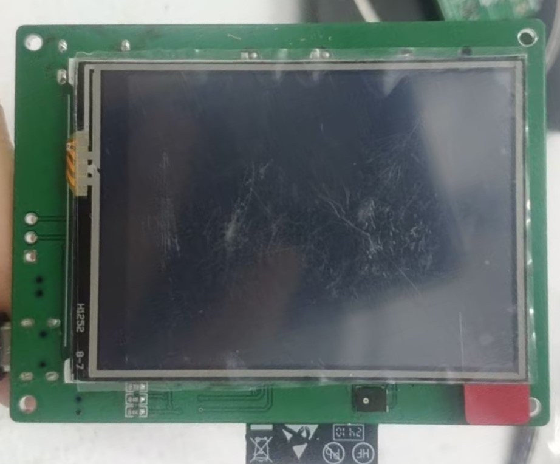

# ESP32小钟

## 硬件配置
### 模块
使用乐鑫ESP32-S3-WROOM-1-N16R8模块进行设计，该模块使用ESP32-S3 SoC，拥有8MB PSRAM和16MB FLASH。ESP32-S3支持2.4Ghz WIFI网络和BLE5低功耗蓝牙技术，搭载 Xtensa® 32 位 LX7 双核处理器, 并且拥有丰富的外设接口、GPIO。

### 外设
- ILI9341 SPI 2.4英寸 320x320 LCD 屏幕
- XPT2045 SPI 触摸控制器
- SD 读卡器
- MP34DT05 PDM 麦克风
- 2*NS4168 I2S 双扬声器
- DS1302 RTC 时钟
- RGB 彩灯
- CH340、ESP USB

## 软件
### 时钟
使用ESP IDF进行程序设计，语言使用C++，图形库使用LVGL v9.1，代码写的很烂，已经实现如下功能：
  - SNTP 网络授时
  - 断电持续计时
  - 音乐播放
  - SmartConfig 一键配网

### 编译
- 安装和配置IDF环境
- 递归克隆：
  ```
  git clone --depth=1 --recursive <url to this repo>
  ```
- 使用VS Code打开
  ```
  code <path to this repo>
  ```
- 点击下方扳手按钮编译

## 原理图设计
- P1 核心、电源
  
- P2 外设
  

## PCB设计
- 正面
  
- 背面
  

## 实物图
- 正面
  
- 背面
  

### 开源
硬件开源在[oshwhub](https://oshwhub.com/sunflower2333/2024clock)立创开源平台，软件开源在Github。